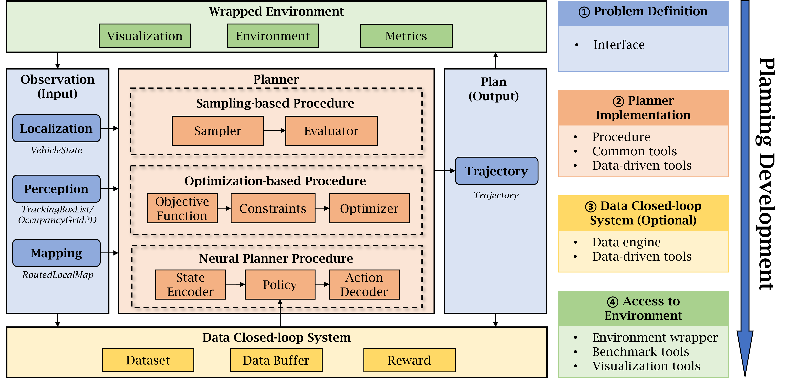

# SPIDER

Self-driving Planning and Intelligent Decision-making Engine with Reinforcement learning

## Installation
The python package has been released to pypi: https://pypi.org/project/spider-python/.

You are welcome to install it with `pip install spider-python` to have a try 
and provide valuable suggestions for further development of this project.

## Overall Framework
The overall framework of the SPIDER planning module, 
including defining a unified data interface 
and coarse-grained modular decomposing of the internal procedures of the planner.

<p align="center">
    <br/>
    <em>Overall framework of SPIDER</em>
</p>

## Build a Planner with SPIDER
To have a glimpse of its capability, you can try to launch a demo script of LatticePlanner with 
```python
import spider
spider.teaser()
```

And you shall see how the LatticePlanner(simplified) implemented conveniently with our tools runs in a simple environment.

[//]: # (![Lattice Planner]&#40;./display_assests/LatticePlanner.gif&#41;)
[//]: # (<figure style="max-width: 70vw; margin: 0 auto; text-align: center;">)

[//]: # (  )

[//]: # (  <figcaption style="font-style: italic;">Lattice Planner</figcaption>)

[//]: # (</figure>)

<p align="center">
    <br/>
    <em>Lattice Planner</em>
</p>

[//]: # (| ![OpenAI Logo]&#40;./display_assests/LatticePlanner.gif&#41; |)

[//]: # (|:----------------------------------------------------:|)

[//]: # (|                *Caption: OpenAI Logo*                |)

More demo planners implemented with SPIDER are listed in planner_zoo, 
in purpose of better understanding of the integration of the tools under different frameworks,
and also easy reusing as baseline algorithms for your own research.
Here shows another planner which attaches an optimizer to the LatticePlanner:

[//]: # (![Optimized Lattice Planner]&#40;./display_assests/OptimizedLatticePlanner.gif&#41;)

<p align="center">
    <br/>
    <em>Optimized Lattice Planner</em>
</p>

Significantly, SPIDER provides a set of tools to build data engines and data-driven planners, 
along with some implementions of the policy learning algorithms including IL and RL.
Both log-replay and closed-loop training/testing are easy to be conducted with SPIDER. 
Here are the examples of testing with GRU-IL and DQN-RL:

[//]: # (![GRUPlanner &#40;log-replay testing&#41;]&#40;./display_assests/GRU_log_replay.gif&#41;)

[//]: # (![DQNPlanner &#40;closed-loop testing&#41;]&#40;./display_assests/DQNPlanner0.gif&#41;)
<p align="center">
    <br/>
    <em>GRUPlanner (log-replay testing)</em>
</p>
<p align="center">
    <br/>
    <em>DQNPlanner (closed-loop testing)</em>
</p>


# Access to the Environment
What's more, a unified interface of SPIDER planners contributes to 
the easy access, deployment and migration for different environments.
If you have already got highway-env in your environment 
which can be installed with `pip install highway-env`, you can try another teaser 
about how spider gets access to the data interface conveniently and makes it easy to 
configure the environment:
```python
from spider.interface.highway_env import HighwayEnvBenchmarkGUI
HighwayEnvBenchmarkGUI.launch()
```

[//]: # (![LatticePlanner in HighwayEnv]&#40;./display_assests/LatticePlanner_highway.gif&#41;)

<p align="center">
    <br/>
    <em>LatticePlanner in HighwayEnv</em>
</p>

Also, we provide the support for CARLA simulator which is a more realistic environment for self-driving research.
<p align="center">
    <br/>
    <em>LatticePlanner in CARLA</em>
</p>

## Documentation
coming soon...

## Citation
coming soon...

## Contact Information
If you have any problem, please feel free to contact me:

Author: Zelin Qian(钱泽林)

Institution: School of Vehicle and Mobility, Tsinghua University, China

Email: qzl22@mails.tsinghua.edu.cn